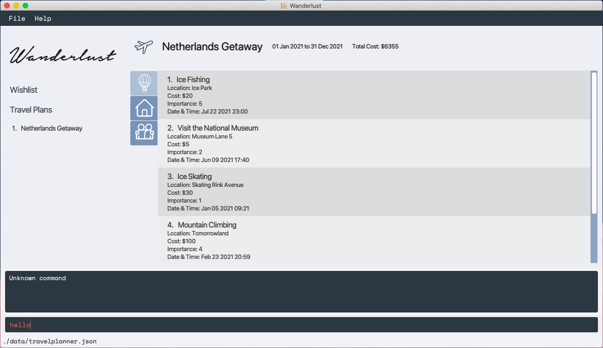

Travel inspirations come in bits and pieces.
At the start of every travel planning, we often only have a vague idea of the activities we are interested in and not a concrete schedule that optimises our travel time and satisfaction.

As a result, travel planning is often a hot mess with little structure.

WanderLust aims to create an efficient and organised way for travellers to plan out their trips.
Every pinned activity and travel plan can be quickly added, modified and retrieved right from the CLI -- an extremely streamlined and quick process for the CLI-proficient traveller.
Relevant information can be retrieved right when and where you need them. With WanderLust, travel planning will be simple and hassle-free.

#### Site Map

* [User Guide](https://ay2021s1-cs2103-t14-3.github.io/tp/UserGuide.html)
* [Developer Guide](https://ay2021s1-cs2103-t14-3.github.io/tp/DeveloperGuide.html)
* [About Us](https://ay2021s1-cs2103-t14-3.github.io/tp/AboutUs.html)

#### Acknowledgement

This project is based on the AddressBook-Level3 project created by the [SE-EDU](https://se-education.org) initiative.
