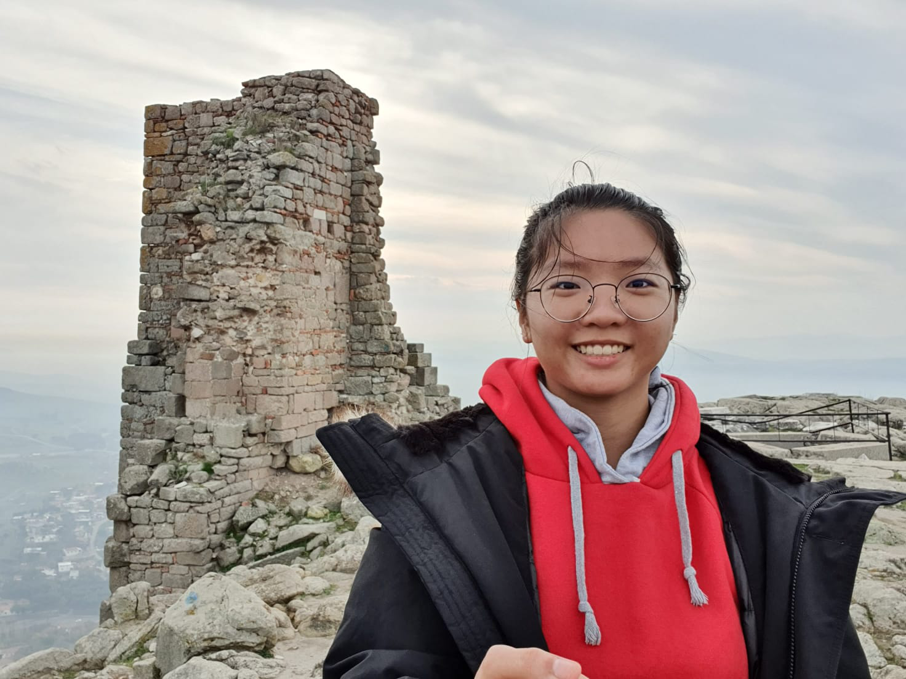
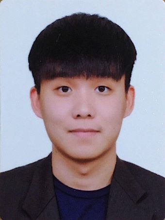
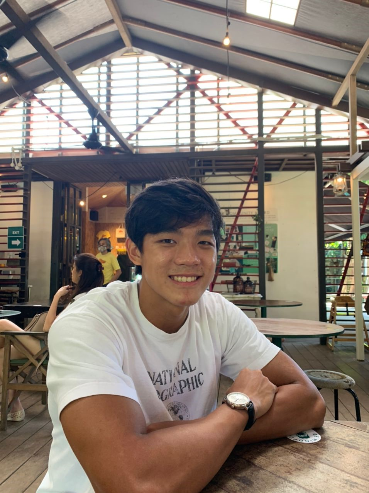
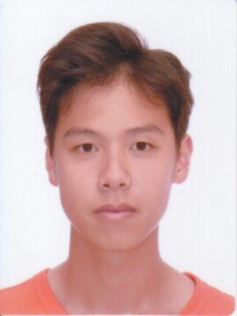
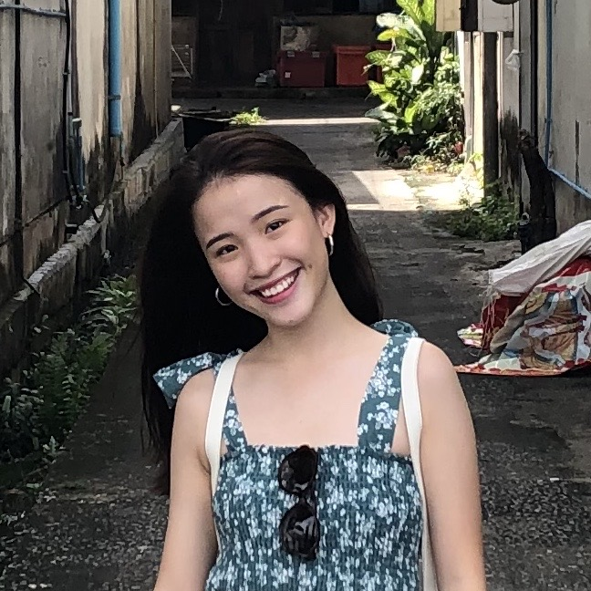

Wanderlust was developed by [Team CS2103-T14-3](https://github.com/orgs/AY2021S1-CS2103-T14-3/people).

We are a team based in the [School of Computing, National University of Singapore](http://www.comp.nus.edu.sg).

## Project team

### Prof. Damith C. Rajapakse

[[homepage](http://www.comp.nus.edu.sg/~damithch)]

[[github](https://github.com/damithc)]

* Role: Project Advisor

### Lim Hai Shan

[[github](http://github.com/underthehai)][[PPP](team/underthehai.html)]

* Role: Developer (In charge of Model)
* Responsibilities: Testing

### Lye Yi Xian

[[github](http://github.com/lyeyixian)][[PPP](team/lyeyixian.html)]

* Role: Team Lead (In charge of Storage)
* Responsibilities: Integration, Deliverables and deadlines

### Teo Jia wei

[[github](https://github.com/jiaweiteo)][[PPP](team/jiaweiteo.html)]

* Role: Developer (In charge of Model)
* Responsibilities: Scheduling and tracking, Documentation, Integration

### Timothy Ong Jing Kai

[[github](http://github.com/timjkong)][[PPP](team/timjkong.html)]

* Role:  Developer (In charge of Logic)
* Responsibilities: Code quality

### Toh Xuan Ning Jeanne

[[github](http://github.com/jeannetoh99)][[PPP](team/jeannetoh99.html)]

* Role: Developer (In charge of Ui)
* Responsibilities: Documentation
