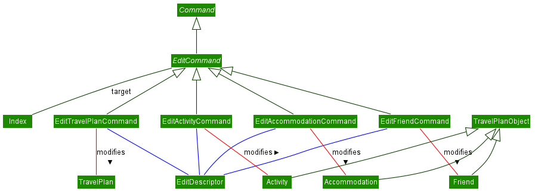
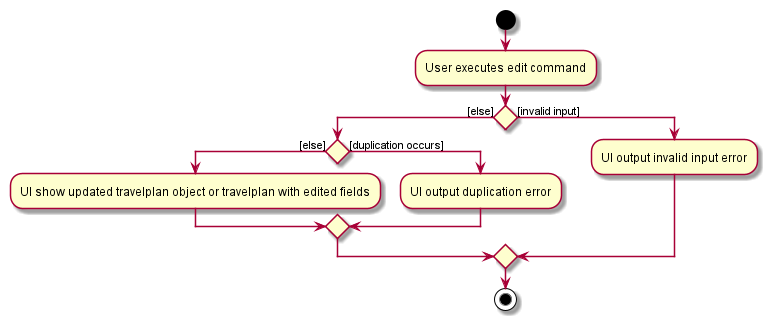
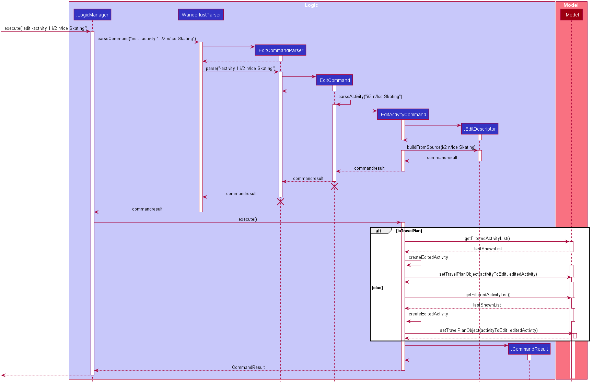
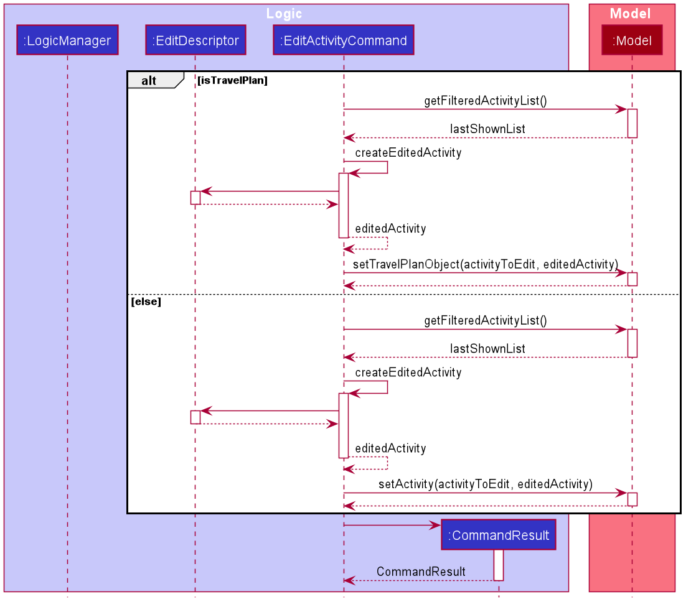
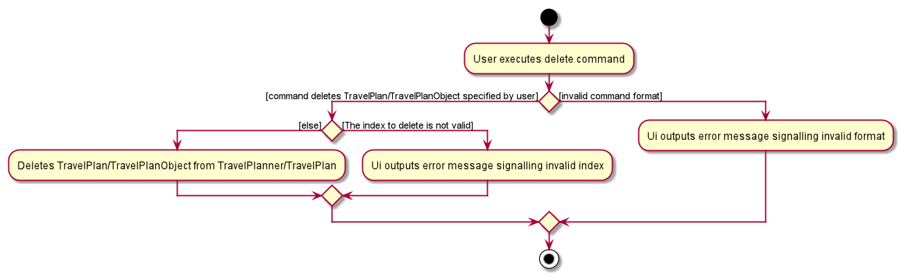

* Table of Contents
{:toc}

--------------------------------------------------------------------------------------------------------------------

## **Introduction**

### Purpose
This document is written to describe the architecture and software design decisions for the desktop application, _wanderlust_.

### Scope
The goal of this document is to cover the high-level system architecture and design. It will also cover the implementation of each feature in _wanderlust_.

### Audience
The intended audience is any person who is looking to understand the system architecture and design of _wanderlust_.

--------------------------------------------------------------------------------------------------------------------

## **Setting up, getting started**

Refer to the guide [_Setting up and getting started_](SettingUp.md).

--------------------------------------------------------------------------------------------------------------------

## **Design**

### Architecture

The ***Architecture Diagram*** given above explains the high-level design of the App. Given below is a quick overview of each component.

:bulb: **Tip:** The `.puml` files used to create diagrams in this document can be found in the [diagrams](https://github.com/AY2021S1-CS2103-T14-3/tp/tree/master/docs/diagrams) folder. Refer to the [_PlantUML Tutorial_ at se-edu/guides](https://se-education.org/guides/tutorials/plantUml.html) to learn how to create and edit diagrams.

**`Main`** has two classes called [`Main`](https://github.com/AY2021S1-CS2103-T14-3/tp/blob/master/src/main/java/seedu/address/Main.java) and [`MainApp`](https://github.com/AY2021S1-CS2103-T14-3/tp/blob/master/src/main/java/seedu/address/MainApp.java). It is responsible for,
* At app launch: Initializes the components in the correct sequence, and connects them up with each other.
* At shut down: Shuts down the components and invokes cleanup methods where necessary.

[**`Commons`**](#common-classes) represents a collection of classes used by multiple other components.

The rest of the App consists of four components.

* [**`UI`**](#ui-component): The UI of the App.
* [**`Logic`**](#logic-component): The command executor.
* [**`Model`**](#model-component): Holds the data of the App in memory.
* [**`Storage`**](#storage-component): Reads data from, and writes data to, the hard disk.

Each of the four components,

* defines its *API* in an `interface` with the same name as the Component.
* exposes its functionality using a concrete `{Component Name}Manager` class (which implements the corresponding API `interface` mentioned in the previous point.

For example, the `Logic` component (see the class diagram given below) defines its API in the `Logic.java` interface and exposes its functionality using the `LogicManager.java` class which implements the `Logic` interface.

**How the architecture components interact with each other**

The *Sequence Diagram* below shows how the components interact with each other for the scenario where the user issues the command `delete -activity 1`.

The sections below give more details of each component.

### UI component

**API** :
[`Ui.java`](https://github.com/AY2021S1-CS2103-T14-3/tp/blob/master/src/main/java/seedu/address/ui/Ui.java)

The UI consists of a `MainWindow` that is made up of parts e.g.`CommandBox`, `ResultDisplay`, `TravelPlannerPanel`, `StatusBarFooter` etc. All these, including the `MainWindow`, inherit from the abstract `UiPart` class.

The `UI` component uses JavaFx UI framework. The layout of these UI parts are defined in matching `.fxml` files that are in the `src/main/resources/view` folder. For example, the layout of the [`MainWindow`](https://github.com/AY2021S1-CS2103-T14-3/tp/blob/master/src/main/java/seedu/address/ui/MainWindow.java) is specified in [`MainWindow.fxml`](https://github.com/AY2021S1-CS2103-T14-3/tp/blob/master/src/main/resources/view/MainWindow.fxml)

The `UI` component,

* Executes user commands using the `Logic` component.
* Listens for changes to `Model` data so that the UI can be updated with the modified data.

### Logic component

**API** :
[`Logic.java`](https://github.com/AY2021S1-CS2103-T14-3/tp/blob/master/src/main/java/seedu/address/logic/Logic.java)

1. `Logic` uses the `WanderlustParser` class to parse the user command.
1. This results in a `Command` object which is executed by the `LogicManager`.
1. The command execution can affect the `Model` (e.g. adding a travel plan).
1. The result of the command execution is encapsulated as a `CommandResult` object which is passed back to the `Ui`.
1. In addition, the `CommandResult` object can also instruct the `Ui` to perform certain actions, such as displaying help to the user.

Given below is the Sequence Diagram for interactions within the `Logic` component for the `execute("delete -activity 1")` API call.

:information_source: **Note:** The lifeline for `DeleteCommandParser` should end at the destroy marker (X) but due to a limitation of PlantUML, the lifeline reaches the end of diagram.

### Model component

**API** : [`Model.java`](https://github.com/AY2021S1-CS2103-T14-3/tp/blob/master/src/main/java/seedu/address/model/Model.java)

The `Model`,

* stores a `UserPref` object that represents the user’s preferences.
* stores the travel planner data.
* exposes unmodifiable `ObservableList<TravelPlan>`, `ObservableList<Activity>`, `ObservableList<Accommodation>`, `ObservableList<Friend>` that can be 'observed' e.g. the UI can be bound to this list so that the UI automatically updates when the data in the list change.
* does not depend on any of the other three components.

### Storage component

**API** : [`Storage.java`](https://github.com/AY2021S1-CS2103-T14-3/tp/blob/master/src/main/java/seedu/address/storage/Storage.java)

The `Storage` component,
* can save `UserPref` objects in json format and read it back.
* can save the travel planner data in json format and read it back.

### Common classes

Classes used by multiple components are in the `seedu.address.commons` package.

--------------------------------------------------------------------------------------------------------------------

## **Implementation**

This section describes some noteworthy details on how certain features are implemented.

### Changing Directory

#### Implementation

*Wanderlust*'s Ui supports navigating to different *travel plans* or *wishlist* so that users can view their desired
*travel plan* or *wishlist* easily. Starting up *Wanderlust* will show the default view of a *wishlist* and users
can use the `goto` command to navigate to their desired directory.

`TravelPlannerPanel`, `TravelPlanPanel` and `TravelPlanObjectListPanel` provide the core components for the display of
*Wanderlust*. When we are in the directory of *travelplan* or *wishlist*, `MainWindow` renders all 3 of the above
components. `TravelPlannerPanel` highlights the directory we are currently in, `TravelPlanPanel` displays the `name` of the
directory and if it is a *travelplan*, it will show the `date` of the *travelplan* as well. Lastly, `TravelPlanObjectListPanel`
displays the respective `activity`, `accommodation` and `friend` list in the UI of a particular directory. Do note that
`wishlist` do not contain any `accommodation` or `friend` list. (The UI will not display any list)

Both `TravelPlannerPanel` and `TravelPlanObjectListPanel` make use of JavaFX's `ListView` to display the list of `travelplan`
or `activity`/`accommodation`/`friend` respectively.

`TravelPlannerPanel` utilizes JavaFX's `Label` to display the `name` of the directory.

`TravelPlanObjectListPanel` utilizes `TabPane` and `Tab` to display the different `activity`/`accommodation`/`friend` tabs
respectively.

The class diagram below shows the relevant classes involved:

#### Navigating between directories

`MainWindow` and `CommandResult` facilitates the navigation between directories.

Firstly, `MainWindow#fillInnerParts()` initializes an `OberservableDirectory` which **listens** to any directory changes.
`MainWindow#executeCommand()` is then called when user enters a `goto` command into the application. `MainWindow#executeCommand()`
initializes all changes to what is displayed by the UI by calling `Logic#execute()` which returns a `CommandResult`.
From `Logic#execute()`, `MainWindow#handleDirectoryChange()` will navigate the current directory to the one input by the user, changing the
UI to view the new directory. From `CommandResult`, the `ResultDisplay` Ui will then output a text specifying which directory
has been navigated to.

The activity diagram below illustrates the flow of execution when the UI decides which directory to view:

Below is a sequence diagram that shows a scenario whereby the UI navigates to a specified `travelplan` in `Wanderlust`:

#### Design Consideration:

Aspect: How navigation between directory works

- **Alternative 1 (Current Choice)**: Initializing an observable directory in Wanderlust.
  - Pros: Main Window will always be listen to any changes in directory, allowing UI to switch fast
  - Cons: More work has to be done to sync up the UI with the model as we have to create an ObservableDirectory class and
  link to the model manager.

- **Alternative 2**: Passing the Directory as a parameter in CommandResult method
  - Pros: Easy to implement since we just have to return a new CommandResult which has an additional parameter of Directory.
  - Cons: Break the abstraction layer as Commands (Logic) should not have to be aware of how the Model is working.

### Editing Information

#### Implementation
The proposed editing mechanism is facilitated by `EditDescriptor`, `Index` and `EditCommand` which extends `Command`.
Editing can be done to travelplan objects such as `Friend`, `Accommodation` and `Activity` or to `TravelPlan`.

`EditCommand` uses `Index` to identify the object to be modified.
`Index` provides standardisation between the components to refer to a specific travel plan object or travelplan within a list.

`EditCommand` uses `EditDescriptor` to create an edited object.
`EditDescriptor` provides method `buildFromSource(source)` to store and access edited fields specified within the user input.

Each object has a specific set of valid fields that can be modified.
- `Activity`: Name, Importance, Cost, DateTime, Location
- `Accommodation`: Name, StartDate, EndDate, Location, Cost
- `Friend`: Name, Passport, Mobile
- `TravelPlan`: Name, StartDate, EndDate

EditCommand must have at least one field that is edited. Any fields that are invalid will throw an error.
Hence, child classes of EditCommand accounts for editing valid types of field. Each of the following classes extends `EditCommand`
- `EditActivityCommand`
- `EditAccommodationCommand`
- `EditFriendCommand`
- `EditTravelPlanCommand`

`EditCommand` accounts for duplicated objects.

`Activity` contain duplicates when two instances have the same name.

`Friend` contain duplicates when two instances have the same passport number.

`Accommodation` contains duplicates when two instances have the same name, startDate and endDate

`TravelPlan` contains duplicates when two instances have the same name
When the editing of an object results in a duplicated edited object within travelplan list or travelplan object list, an error will be thrown.

Given below is the class diagram showing relevant classes involved

#### Editing a TravelPlan or TravelPlanObject
Given below is an example usage scenario and how the edit mechanism behaves at each step.

Below is a sequence diagram that shows a scenario whereby the user edits a specified activity in Wanderlust

The TravelPlan Object or TravelPlan by calling `Logic#execute()` which returns a `CommandResult`. From `CommandResult`, the Ui will then
show a message about the successful edited object.

* Note: Due to limitation of PlantUML which do not have an `sd reference frame` implementation, 
the image below contains further details from the `execute` reference frame from the above sequence diagram.

### Design Consideration
Aspect: How edit executes

- **Alternative 1 (Current Choice)**: Editing in the current travelplan directory
  - Pros: Only require the index shown on the UI to identify the travelplan object to be edited
  - Cons: More work has to be done to sync the retrieval of lists of travel plan object that corresponds to the current travelplan directory

- **Alternative 2**: Require the user to switch travel plan object tabs within the travelplan to edit the specified travelplan object
  - Pros: User will not require to specify the type of travelplan object to be edited
  - Cons: Still require user to specify editing of a travelplan object or travelplan

### Adding a TravelPlan or TravelPlanObject

#### Implementation

*Wanderlust*'s Ui allows users to add a `TravelPlan` to the `TravelPlanner`, an `Activity` to the `Wishlist` and a `TravelPlanObject`
to the `TravelPlan` in the current directory.

`MainWindow#executeCommand()` is called when the user enters a `add` command into the application. `MainWindow#executeCommand()`
adds the TravelPlan/TravelPlanObject by calling `Logic#execute()` which returns a `CommandResult`. `Logic#execute()` also sets the
the `Directory` of the `ObservableDirectory` to the updated `Directory` after adding the TravelPlan/TravelPlanObject so the Ui displays
the updated list of `TravelPlan`s/`TravelPlanObject`s. From `CommandResult`, the `ResultDisplay` Ui will then output a text confirming
to the user that the command was successfully executed.

The activity diagram below shows a scenario whereby a user adds inputs an add command:

The sequence diagram below shows a scenario whereby a user adds an `Activity` to the `TravelPlan`/`Wishlist` in the current directory:

#### Design Consideration:

Aspect: How to add `TravelPlanObject`s to the `TravelPlan` in the current `Directory`

- **Alternative 1 (Current Choice)**: Use individual add commands for each sub-class of `TravelPlanObject`.
  - Pros: Greater abstraction and a more logical implementation since there is a command for each sub-class.
  - Cons: Greater repetition of code.

- **Alternative 2**: Using a `AddTravelPlanObjectCommand` class.
  - Pros: Lesser repetition of code.
  - Cons: Lesser abstraction.

### Deleting a TravelPlan or TravelPlanObject

#### Implementation

*Wanderlust*'s Ui allows users to delete a `TravelPlan` from the `TravelPlanner`, an `Activity` from the `Wishlist` and a `TravelPlanObject`
from the `TravelPlan` in the current directory.

`MainWindow#executeCommand()` is called when the user enters a `delete` command into the application. `MainWindow#executeCommand()`
deletes the TravelPlan/TravelPlanObject by calling `Logic#execute()` which returns a `CommandResult`. `Logic#execute()` also sets the
the `Directory` of the `ObservableDirectory` to the updated `Directory` after deleting the TravelPlan/TravelPlanObject so the Ui displays
the updated list of `TravelPlan`s/`TravelPlanObject`s. From `CommandResult`, the `ResultDisplay` Ui will then output a text confirming
to the user that the `delete` command was successfully executed.

The activity diagram below shows a scenario whereby a user inputs the `delete` command:

The sequence diagram of the `delete` command has been shown above under the [Logic Component](#logic-component) of the developer guide.

#### Design Consideration:

Aspect: How to delete a `TravelPlanObject` from the `TravelPlan` in the current `Directory`

- **Alternative 1 (Current Choice)**: Use individual delete commands for each sub-class of `TravelPlanObject`.
    - Pros: Greater abstraction and a more logical implementation since there is a command for each sub-class.
    - Cons: Greater repetition of code.

- **Alternative 2**: Using a `DeleteTravelPlanObjectCommand` class.
    - Pros: Lesser repetition of code.
    - Cons: Lesser abstraction and the logic will be reliant on one class.

### Copy feature

#### Implementation
The copy mechanism supports copying an `activity` from `Wishlist` to a specific `TravelPlan`. It is facilitated by the
add mechanism, except activities can be added to **any** `TravelPlan`  in the `TravelPlanner`, referenced by their index
*(travel plan index)*. The copy mechanism adds a **deep copy** of the activity in `Wishlist` to the specified `TravelPlan`,
not the same instance. Thus, if any activity was edited in one directory, it should not affect all other copies.

:information_source: **Note:** The copy command can only be called when
the current directory is the wishlist. Hence, index used to reference activities *(activity index)* refers to that in
the `filteredWishlist` in `Model`. This means, even if the `find` command is used to filter the activities in the
wishlist, the indexes in the `filteredWishlist` will be updated accordingly (and so will the Ui). Hence, as long as the
user uses the index as displayed in the Ui, the correct activity will be referenced.

The following sequence diagram shows how the copy operation works:

:information_source: **Note:** The lifeline for `CopyCommandParser` and
`CopyCommand` should end at the destroy marker (X) but due to a limitation of PlantUML, the lifeline reaches the end of
diagram.

:information_source: **Note:** The indexes used by CopyCommand in the `execute()` method (after parsing) is zero-based.

The following activity diagram summarizes what happens when a user executes the `copy` command:

#### Design consideration:

Aspect: How to duplicate activity *(deep/shallow copy)*
- **Alternative 1 (Current Choice)**: Using a deep copy.
    - Pros: More flexibility to have different variations of the activity in different directories (e.g. different dates/times, etc).
    - Cons: Each instance is not synced with the rest. Users have to update each copy separately if they wish to do so.
    *However, there is flexibility to extend other commands (e.g. Edit command) to update all deep copies of the same activity.*
- **Alternative 2**: Using a shallow copy.
    - Pros: Only one instance of each activity means users can update all copies of the activity at once.
    - Cons: Less flexibility to change a copied activity without affecting other copies.
- **Alternative 3**: Have variations of the copy command to allow both deep/shallow copy.
    - Pros: Best of both worlds. Allows for flexibility and convenience at the same time.
    - Cons: Harder to implement. Users need a way to differentiate deep/shallow copies to avoid unintentionally editing
    a shallow copy. Potentially more edge cases to think about and handle.

### Move Feature

#### Implementation

The move mechanism makes use of both the copy and delete mechanism.

### Find Feature

#### Implementation

Current implementation of Find feature is facilitated by `NameContainsKeywordsPredicate` which implements
`Predicate<Nameable>` and has the **test** method overriden with a custom implementations.

The `NameContainsKeywordsPredicate#test(Nameable)` is as follows:
* loops through the **keywords** (of type `List<String>`) and return true if there is any match with the `Nameable`

`Nameable` provides the following operation:
* `Nameable#getName()` - Return the name attribute of a `TravelPlanObject`

`NameContainsKeywordsPredicate` will be passed to `Model#updateFilteredXYZList(Predicate)`
(`updateFilteredActivityList`, etc.). The filtered list will then be updated according to the given `Predicate` and
automatically reflected on the Ui.

The class diagram shows the relevant classes involved:

The following sequence diagram shows how the find operation works:

The following activity diagram summarizes what happens when a user executes the find command:

--------------------------------------------------------------------------------------------------------------------

## **Documentation, logging, testing, configuration, dev-ops**

* [Documentation guide](Documentation.md)
* [Testing guide](Testing.md)
* [Logging guide](Logging.md)
* [Configuration guide](Configuration.md)
* [DevOps guide](DevOps.md)

--------------------------------------------------------------------------------------------------------------------

## **Appendix: Requirements**

### Product scope

**Target user profile**:

* Has a need to store their travel plans in an organised manner
* Has a need to store activities that they may visit as a wishlist
* Prefers desktop apps over other types
* Can type fast
* Prefers typing to mouse interactions
* Is reasonably comfortable using CLI apps

**Value proposition**:
* Manage travel plans faster than using a typical mouse/GUI driven app.
Removes the need for a physical travel planner. Increase the motivation to plan travelling by making planning easier and interactive.

### User stories

Priorities: High (must have) - `* * *`, Medium (nice to have) - `* *`, Low (unlikely to have) - `*`

| Priority | As a …​                                    | I want to …​                     | So that I can…​                                                        |
| -------- | ------------------------------------------ | ------------------------------ | ---------------------------------------------------------------------- |
| `* * *`  | new user                                   | read the user guide            | be familiar with the usages and features                |
| `* * *`  | user                                       | save activities in a wishlist               | use it for future travel plans      |
| `* * *`  | user                                       | add items to a travel plan             | note down important items related to my travel plan      |
| `* * *`  | user                                       | delete an item       | remove unwanted items              |
| `* * *`  | user                                       | modify an item       | edit any last minute changes              |
| `* * *`  | frequent user                              | have a list of items    | easily see my travel plans              |
| `* * *`  | user                                       | be able to switch between travel plans   | navigate to travel plans easily              |
| `* *`    | user                                       | input accommodation details         | easily remember where I am going to stay           |
| `* *`    | user                                       | input cost of activity  | track the price of each activities easily                      |
| `* *`    | user                                       | input timing to an activity         | plan a schedule for my travel plan               |
| `* *`    | user                                       | record particulars of my friends travelling with me         | make group reservations/ bookings more convenient.  |
| `* *`    | user                                       | sort items  | view my items in a preferred manner            |
| `* *`    | user                                       | create priority levels for activities | rank the level of importance of each activities    |
| `*`      | user                                       | have a feature to search  | find and filter my desired items efficiently  |
| `*`      | user                                       | have a move and copy feature | move/copy activities in my wishlist to my travel plan easily  |
| `*`      | user                                       | be able to switch tabs | view my activities, accommodation and friends easily |

### Use cases

(For all use cases below, the **System** is the `Wanderlust` and the **Actor** is the `user`, unless specified otherwise)

**Use case: UC01 - Navigate to a specific travel plan**

**MSS**

1.  User requests to navigate to a specific travel plan.
2.  Wanderlust navigates to the travel plan that user requested.

    Use case ends.

**Extensions**

* 1a. The specific travel plan doesn't exist.
    * 1a1. Wanderlust shows an error message.

      Use case ends.

**Use case: UC02 - Navigate to the wishlist**

**MSS**

1.  User requests to navigate to the wishlist.
2.  Wanderlust navigates to wishlist.

    Use case ends.
    
**Extensions**

* 1a. User is already on wishlist.
    * 1a1. Wanderlust remains on wishlist.
    
    Use case ends.

**Use case: UC03 - Add a travel plan**

**MSS**

1.  User requests to add a travel plan
2.  Wanderlust creates the newly travel plan and directs user to the new travel plan.

    Use case ends.

**Extensions**

* 1a. The input command format is invalid.
    * 1a1. Wanderlust shows an error message.

      Use case ends.

**Use case: UC04 - Add an activity**

**MSS**

1.  User <ins>navigates to a specific travel plan (UC1).</ins>
2.  User requests to add an activity.
3.  Wanderlust shows the added activities in the current directory.

    Use case ends.

**Extensions**

* 1a. User <ins>navigates to the wishlist (UC2)</ins>.

    Use case resumes at step 2.

* 2a. The input command format is invalid.
    * 2a1. Wanderlust shows an error message.

      Use case ends.

**Use case: UC05 - Add an accommodation**

**MSS**

1.  User <ins>navigates to a specific travel plan (UC1).</ins>
2.  User requests to add an accommodation.
3.  Wanderlust shows the added accommodation in the current travel plan.

    Use case ends.

**Extensions**

* 1a. User is at the wishlist.
    * 1a1. User requests to add accommodation.
    * 1a2. Wanderlust shows an error message.

    Use case ends.

* 2a. The input command format is invalid.
    * 2a1. Wanderlust shows an error message.

      Use case ends.

**Use case: UC06 - Add a friend**

**MSS**

1.  User <ins>navigates to a specific travel plan (UC1).</ins>
2.  User requests to add a friend.
3.  Wanderlust shows the added friend in the current travel plan.

    Use case ends.

**Extensions**

* 1a. User is at the wishlist.
    * 1a1. User requests to add a friend.
    * 1a2. Wanderlust shows an error message.

    Use case ends.

* 2a. The input command format is invalid.
    * 2a1. Wanderlust shows an error message.

      Use case ends.

**Use case: UC07 - Delete a travel plan**

**MSS**

1.  User requests to delete a travel plan.
2.  Wanderlust shows that the travel plan has been deleted.

    Use case ends.

**Extensions**

* 1a. The input command format is invalid.
    * 1a1. Wanderlust shows an error message.

      Use case ends.

* 1b. The travel plan specified does not exist.
    * 1b1. Wanderlust shows an error message.

      Use case ends.

**Use case: UC08 - Delete an activity**

**MSS**

1.  User <ins>navigates to a specific travel plan (UC1).</ins>
2.  User requests to delete an activity.
3.  Wanderlust shows that the activity has been deleted.

    Use case ends.

**Extensions**

* 1a. User <ins>navigates to the wishlist (UC2)</ins>.

    Use case resumes at step 2.

* 2a. The input command format is invalid.
    * 2a1. Wanderlust shows an error message.

      Use case ends.

* 2b. The activity specified does not exist.
    * 2b1. Wanderlust shows an error message.

      Use case ends.

**Use case: UC09 - Delete an accommodation**

**MSS**

1.  User <ins>navigates to a specific travel plan (UC1).</ins>
2.  User requests to delete an accommodation.
3.  Wanderlust shows that the accommodation has been deleted.

    Use case ends.

**Extensions**

* 1a. User is at the wishlist.
    * 1a1. User requests to delete accommodation.
    * 1a2. Wanderlust shows an error message.

    Use case ends.

* 2a. The input command format is invalid.
    * 2a1. Wanderlust shows an error message.

      Use case ends.

* 2b. The accommodation specified does not exist.
    * 2b1. Wanderlust shows an error message.

      Use case ends.

**Use case: UC10 - Delete a friend**

**MSS**

1.  User <ins>navigates to a specific travel plan (UC1).</ins>
2.  User requests to delete a friend.
3.  Wanderlust shows that the friend has been deleted.

    Use case ends.

**Extensions**

* 1a. User is at the wishlist.
    * 1a1. User requests to delete a friend.
    * 1a2. Wanderlust shows an error message.

    Use case ends.

* 2a. The input command format is invalid.
    * 2a1. Wanderlust shows an error message.

      Use case ends.

* 2b. The friend specified does not exist.
    * 2b1. Wanderlust shows an error message.

      Use case ends.

**Use case: UC11 - Edit a travel plan**

**MSS**

1. User <ins>navigates to a specific travel plan (UC1).</ins>
2. User requests to edit travel plan.
3. Wanderlust shows that the travel plan has been edited.

   Use case ends.

**Extensions**

*  1a. User is at the wishlist.

     Use case resumes at step 2.

* 2a. The input command format is invalid.
    * 2a1. Wanderlust shows an error message.

     Use case ends.

* 2b. The travel plan specified does not exist.
    * 2b1. Wanderlust shows an error message.

     Use case ends.

**Use case: UC12 - Edit an activity**

**MSS**

1.  User <ins>navigates to a specific travel plan (UC1).</ins>
2.  User requests to edit an activity.
3.  Wanderlust shows that the activity has been edited.

     Use case ends.

**Extensions**

* 1a. User <ins>navigates to the wishlist (UC2).</ins>.

     Use case resumes at step 2.

* 2a. The input command format is invalid.
    * 2a1. Wanderlust shows an error message.

      Use case ends.

* 2b. The activity specified does not exist.
    * 2b1. Wanderlust shows an error message.

      Use case ends.

**Use case: UC13 - Edit an accommodation**

**MSS**

1.  User <ins>navigates to a specific travel plan (UC1).</ins>
2.  User requests to edit an accommodation.
3.  Wanderlust shows that the accommodation has been edited.

    Use case ends.

**Extensions**

* 1a. User is at the wishlist.
    * 1a1. User requests to edit an accommodation.
    * 1a2. Wanderlust shows an error message.

    Use case ends.

* 2a. The input command format is invalid.
    * 2a1. Wanderlust shows an error message.

      Use case ends.

* 2b. The accommodation specified does not exist.
    * 2b1. Wanderlust shows an error message.

      Use case ends.

**Use case: UC14 - Edit a friend**

**MSS**

1.  User <ins>navigates to a specific travel plan (UC1).</ins>
2.  User requests to edit a friend.
3.  Wanderlust shows that the friend has been edited.

    Use case ends.

**Extensions**

* 1a. User is at the wishlist.
    * 1a1. User requests to edit a friend.
    * 1a2. Wanderlust shows an error message.

    Use case ends.

* 2a. The input command format is invalid.
    * 2a1. Wanderlust shows an error message.

      Use case ends.

* 2b. The friend specified does not exist.
    * 2b1. Wanderlust shows an error message.

      Use case ends.

**Use case: UC15 - View activities**

**MSS**

1.  User <ins>navigates to a specific travel plan (UC1).</ins>
2.  User requests to view activities.
3.  Wanderlust shows the list of activities.

    Use case ends.

**Extensions**

* 1a. User <ins>navigates to the wishlist (UC2)</ins>.

    Use case resumes at step 2.

* 2a. The input command format is invalid.
    * 2a1. Wanderlust shows an error message.

      Use case ends.

**Use case: UC16 - View friends in travel plan**

**MSS**

1.  User <ins>navigates to a specific travel plan (UC1).</ins>
2.  User requests to view friends.
3.  Wanderlust shows the list of friends.

    Use case ends.

**Extensions**

* 2a. The input command format is invalid.
    * 2a1. Wanderlust shows an error message.

      Use case ends.

**Use case: UC17 - View accommodation in travel plan**

**MSS**

1.  User <ins>navigates to a specific travel plan (UC1).</ins>
2.  User requests to view accommodation.
3.  Wanderlust shows the list of accommodation.

    Use case ends.

**Extensions**

* 2a. The input command format is invalid.
    * 2a1. Wanderlust shows an error message.

      Use case ends.

*{More to be added}*

### Non-Functional Requirements

1.  Should work on any mainstream OS_ as long as it has Java `11` or above installed.
2.  The travel planner should be able to hold up to 1000 activities without a noticeable sluggishness in performance for typical usage.
3.  Should be able to respond to user commands within 1 second.
4.  A user with above average typing speed for regular English text (i.e. not code, not system admin commands) should be able to accomplish most of the tasks faster using commands than using the mouse.
5.  Should be a single-user product.
6.  Users familiar with JSON should be able to read and edit the storage file.
7.  Should work without internet connection.
8.  Should not crash when data is given in compatible formats.
9.  The app should be accessible via the downloaded JAR file without any other installations needed.

### Glossary

* **Mainstream OS**: Windows, Linux, Unix, OS-X
* **Wishlist**: A list of potential activities
* **Travel plan**: A list of accommodations and activities in a specified location that include `name`, `start_date` and `end_date`
* **Activity**: Include `name`, `cost`, `location`, `datetime`, `importance`
* **Accommodation**: Include `name`, `location`, `cost`, `startdate` and `enddate` to it
* **Friend**: Contains information about a given friend `name`, `mobile number` and `passport number`
* **Directory**: The two possible directories are `travelplan`, `wishlist`
* **Navigate**: Use the `goto` command to move between directories
* **View**: Use the `show` command to provide a list of specified travel plan object

*{More to be added}*
--------------------------------------------------------------------------------------------------------------------

## **Appendix: Instructions for manual testing**

Given below are instructions to test the app manually.

:information_source: **Note:** These instructions only provide a starting point for testers to work on;
testers are expected to do more *exploratory* testing.

### Launch and shutdown

1. Initial launch

   a. Download the jar file and copy into an empty folder

   b. Run jar file in command prompt and enter `java -jar wanderlust.jar`: Expected: Shows the GUI with a set of sample data. The window size may not be optimum.

2. Saving window preferences

   a. Resize the window to an optimum size. Move the window to a different location. Close the window.

   b. Re-launch the app by running the jar file in the command prompt and enter `java -jar wanderlust.jar`. 
       Expected: The most recent window size and location is retained.
       
### Delete

1. Deleting an activity/accommodation/friend while all activities/accommodation/friends are being shown. We will use `friend` as an example.

   a. Prerequisites: Show all friends using the `show -friend` command. Multiple Friends in the list.

   b. Test case: `delete -friend 1` 
      Expected: First Friend is deleted from the friend list. Details of the deleted friend shown in the status message.

   c. Test case: `delete -friend 0` 
      Expected: No Friend is deleted. Error details shown in the status message.

   d. Other incorrect delete commands to try: `delete`, `delete -friend x`, `...` (where x is larger than the list size) 
      Expected: Similar to previous.
      
2. Deleting a travelplan.

    a. Test case: `delete -travelplan 1` 
      Expected: First travel plan is deleted from the travel plan list. Details of the deleted travel plan shown in the status message.
      
    c. Test case: `delete -travelplan 0` 
        Expected: No travel plan is deleted. Error details shown in the status message.
    
    d. Other incorrect delete commands to try: `delete`, `delete -travelplan x`, `...` (where x is larger than the list size) 
        Expected: Similar to previous.
            

### Add

1. Adding an activity/accommodation/friend while all activities/accommodation/friends are being shown. We will use `friend` as an example.

   a. Prerequisites: Navigate to a valid directory using `goto -travelplan x` (where x is a valid index)
   
   b. Test case: `add -friend n/Tom p/E1234567X m/81234567` 
      Expected: New Friend is added to the friend list. Details of the added friend shown in the status message.

   c. Test case: `add n/Jerry p/E1234567M m/81234561` 
      Expected: Add object type is not specified. No Friend is added. Error details shown in the status message.
    
   d. Test case: `add -friend n/Spark p/E1234567A m/81234568 i/2` 
      Expected: Importance parameter is not valid for Friend. No Friend is added. Error details shown in the status message.

   e. Other incorrect add commands to try: `add`, `add -friend n/Harry` 
      Expected: Error message is thrown.
      
2. Adding a travel plan.

    a. Test case: `add -travelplan n/Europe Trip sd/2021-01-10 ed/2021-02-10` 
       Expected: New travel plan is add to the travel plan list. Details of the travel plan shown in the status message.
      
    b. Test case: `add n/Europe Trip sd/2021-01-10 ed/2021-02-10` 
       Expected: Add object type is not specified. No travel plan is added. Error details shown in the status message.
    
    c. Test case: `add n/Europe Trip sd/2021-01-10 ed/2021-02-10 c/1000` 
       Expected: Cost parameter is not valid for travel plan. No trave plan is added. Error details shown in the status message.
       
    d. Other incorrect add commands to try: `add`, `add -travelplan n/Europe` 
        Expected: Similar to previous.
            

### Edit
 - Note `x` refers to a valid index
 
1. Editing an activity/accommodation/friend while all activities/accommodation/friends are being shown. We will use `activity` as an example.
    
   a. Test case: `edit -activity x i/4` 
      Expected: Edit activity at specified index `x`. Activity selected has updated importance of `4` Details of the activity is shown in the status message.

   b. Test case: `edit -activity x p/E1234593P` 
      Expected: Passport parameter is not valid for Activity. No Activity is edited. Error details shown in the status message.

   c. Test case: `edit x n/Ice Skating` 
      Expected: Edit object type is not specified. No Activity is edited. Error details shown in the status message.
    
   d. Other incorrect add commands to try: `edit -activity` 
      Expected: Error message is thrown.
      
2. Editing a travel plan

   a. Test case: `edit -travelplan x n/New Trip` 
      Expected: Edit the travel plan at specified index `x`. Travel plan selected has updated name of `new Trip` Details of the travel plan is shown in the status message.

   b. Test case: `edit -travelplan x c/123` 
      Expected: Cost parameter is not valid for travel plan. No travel plan is edited. Error details shown in the status message.

   c. Test case: `edit x n/Europe` 
      Expected: Edit object type is not specified. No travel plan is edited. Error details shown in the status message.
    
   d. Other incorrect add commands to try: `edit -travelplan` 
      Expected: Error message is thrown.

### Show

1. Showing an activity/accommodation/friend while in a travel plan directory. We will use `accommodation` as an example.

   a. Prerequisites: Currently in a travel plan directory.
   
   b. Test case: `show -accommodation` 
      Expected: Show the accommodation list in the accommodation tab.
      
   c. Test case: `show -accommodation 1` 
      Expected: Invalid command format. Error details shown in the status message.
      
   d. Test case: `show -accommodation` while in wishlist.  
      Expected: `show` command is not valid in wishlist. Error details shown in the status message.
    
   e. Other incorrect show commands to try: `show -accommodation c/20` 
      Expected: Error message is thrown.

### Find
 - Note `y` refers to keyword provided by user
 - Use the `show` command to view back the unfiltered list.
 
1. Finding an activity/accommodation/friend while in a travel plan directory. We will use `activity` as an example.

   a. Prerequisites: Show list of activity using `show -activity` command. Currently in a travel plan directory.
   
   b. Test case: `find -activity y` 
      Expected: Find all activities that contain y. Activity tab will be updated and display the activites that matches the keyword(s) `y`.

   c. Test case: `find -activity` 
      Expected: Cannot have empty field for the keyword. Error details shown in the status message.

   c. Other incorrect add commands to try: `find`, `find -travelplan` 
      Expected: Invalid command format. Error message is thrown.

2. Finding an activity while in a wishlist.

   a. Prerequisites: Currently in the `wishlist` directory.
   
   b. Test case: `find -activity y` 
      Expected: Find all activities that contain y. Activity tab will be updated and display the activites that matches the keyword(s) `y`.

   c. Test case: `find -activity` 
      Expected: Cannot have empty field for the keyword. Error details shown in the status message.
      
   d. Test case: `find -accommodation y` 
      Expected: Accommodation is not valid in wishlist. Error details shown in the status message.

   c. Other incorrect add commands to try: `find`, `find -friend y` 
      Expected: Invalid command. Error message is thrown.

### Goto

1. Navigate to a `travelplan` or `wishlist` directory. 
   
   a. Test case: `goto -travelplan x` (where x is a valid index) 
      Expected: Navigates to the `travelplan` at specified index `x` . Details of the `travelplan` is shown in the status message.

   b. Test case: `goto -wishlist` (where x is a valid index) 
      Expected: Navigates to the `wishlist`. Details of `wishlist` is shown in the status message.

   c. Test case: `goto -travel plan 0` 
      Expected: Index is invalid, need to start from 1. Directory remains the same. Error details shown in the status message.
    
   d. Test case: `goto -wishlist 1` 
      Expected: Index not required for `wishlist`. Directory remains the same. Error details shown in the status message.

   e. Other incorrect add commands to try: `goto`, `goto -random` 
      Expected: Error message is thrown.

### Sort

1. Sorting an activity/accommodation/friend list while in a `travelplan` directory. We will use `accommodation` as an example.

   a. Prerequisites: Currently in a `travelplan` directory.
   
   b. Test case: `sort -accommodation cost` 
      Expected: Tab switches to `accommodation` tab and returns a sorted list of `accommodation` in the order of decreasing cost.
      
   c. Test case: `sort -accommodation mobile` 
      Expected: `mobile` is not a valid sort keyword for `accommodation`. Error details shown in the status message.
      
   d. Other incorrect sort commands to try: `sort`, `sort -accommdoation 1` 
      Expected: Error message is thrown.
      
2. Sorting an activity list in a `wishlist` directory.
   
   a. Prerequisites: Currently in a `wishlist` directory.
   
   b. Test case: `sort -activity datetime` 
      Expected: `wishlist` returns a sorted list of `activities` in the order of increasing date and time.
      
   c. Test case: `sort -activity mobile` 
      Expected: `mobile` is not a valid sort keyword for `activity`. Error details shown in the status message.
      
   d. Test case: `sort -accommodation name` 
      Expected: `name` is not a valid sort keyword for `activity`. Error details shown in the status message.
      
   e. Other incorrect sort commands to try: `sort`, `sort -friend name` 
      Expected: Error message is thrown.
      
### Copy

1. Copy an activity from the `wishlist` to the specific `travelplan` directory.
 - Note `x` refers to the index of the activity in the `wishlist`.
 - Note `y` refers to the index of the `travelplan`.

   a. Prerequisites: Currently in a `wishlist` directory.
   
   b. Test case: `copy x y` 
      Expected: `activity` at index `x` in the `wishlist` is copied to the `travelplan` at index `y`.
   
   c. Test case:  `copy x y` (Where `x` is more than the size of the activity list in the `wishlist)
      Expected: Invalid index provided. Error details shown in the status message.
      
   c. Test case:  `copy x y` (Where `y` is more than the total number of travel plans)
      Expected: Invalid index provided. Error details shown in the status message.
      
   d. Test case: `copy x y` (When in a `travelplan` directory).
      Expected: Invalid command call at `travelplan` directory. `Copy` can only be called in `wishlist` directory. Error details shown in the status message.
      
   e. Other incorrect copy commands to try: `copy`, `copy x`, `copy y` 
      Expected: Error message is thrown.
      
### Move

1. Move an activity from the `wishlist` to the specific `travelplan` directory. The activity will be deleted from the `wishlist`.
 - Note `x` refers to the index of the activity in the `wishlist`.
 - Note `y` refers to the index of the `travelplan`.

   a. Prerequisites: Currently in a `wishlist` directory.
   
   b. Test case: `move x y` 
      Expected: `activity` at index `x` in the `wishlist` is copied to the `travelplan` at index `y`.
   
   c. Test case:  `move x y` (Where `x` is more than the size of the activity list in the `wishlist)
      Expected: Invalid index provided. Error details shown in the status message.
      
   c. Test case:  `move x y` (Where `y` is more than the total number of travel plans)
      Expected: Invalid index provided. Error details shown in the status message.
      
   d. Test case: `move x y` (When in a `travelplan` directory).
      Expected: Invalid command call at `travelplan` directory. `Copy` can only be called in `wishlist` directory. Error details shown in the status message.
      
   e. Other incorrect copy commands to try: `move`, `move x`, `move y` 
      Expected: Error message is thrown.
      
### Clear

1. Clear the entire data in wanderlust and returns an empty travel planner.

    a. Test case: `clear` 
       Expected: Returns an empty travel planner. Existing data is wiped.
       
       
## *Appendix: Effort*
//TODO:
