* Table of Contents
{:toc}

--------------------------------------------------------------------------------------------------------------------

## **Setting up, getting started**

Refer to the guide [_Setting up and getting started_](SettingUp.md).

--------------------------------------------------------------------------------------------------------------------

## **Design**

### Architecture

The ***Architecture Diagram*** given above explains the high-level design of the App. Given below is a quick overview of each component.

:bulb: **Tip:** The `.puml` files used to create diagrams in this document can be found in the [diagrams](https://github.com/AY2021S1-CS2103-T14-3/tp/tree/master/docs/diagrams/) folder. Refer to the [_PlantUML Tutorial_ at se-edu/guides](https://se-education.org/guides/tutorials/plantUml.html) to learn how to create and edit diagrams.

**`Main`** has two classes called [`Main`](https://github.com/AY2021S1-CS2103-T14-3/tp/blob/master/src/main/java/seedu/address/Main.java) and [`MainApp`](https://github.com/AY2021S1-CS2103-T14-3/tp/blob/master/src/main/java/seedu/address/MainApp.java). It is responsible for,
* At app launch: Initializes the components in the correct sequence, and connects them up with each other.
* At shut down: Shuts down the components and invokes cleanup methods where necessary.

[**`Commons`**](#common-classes) represents a collection of classes used by multiple other components.

The rest of the App consists of four components.

* [**`UI`**](#ui-component): The UI of the App.
* [**`Logic`**](#logic-component): The command executor.
* [**`Model`**](#model-component): Holds the data of the App in memory.
* [**`Storage`**](#storage-component): Reads data from, and writes data to, the hard disk.

Each of the four components,

* defines its *API* in an `interface` with the same name as the Component.
* exposes its functionality using a concrete `{Component Name}Manager` class (which implements the corresponding API `interface` mentioned in the previous point.

For example, the `Logic` component (see the class diagram given below) defines its API in the `Logic.java` interface and exposes its functionality using the `LogicManager.java` class which implements the `Logic` interface.

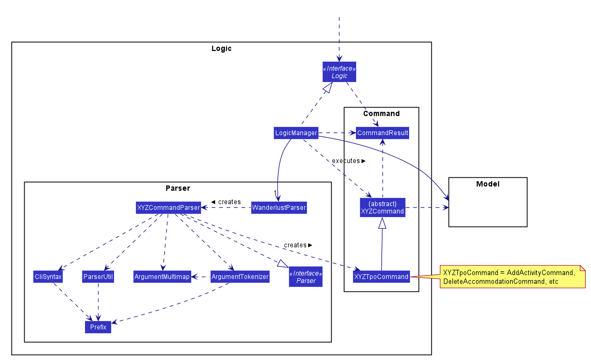

**How the architecture components interact with each other**

The *Sequence Diagram* below shows how the components interact with each other for the scenario where the user issues the command `delete -activity 1`.

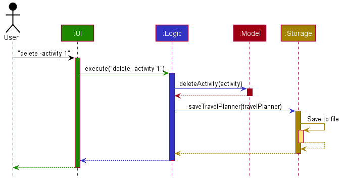

The sections below give more details of each component.

### UI component

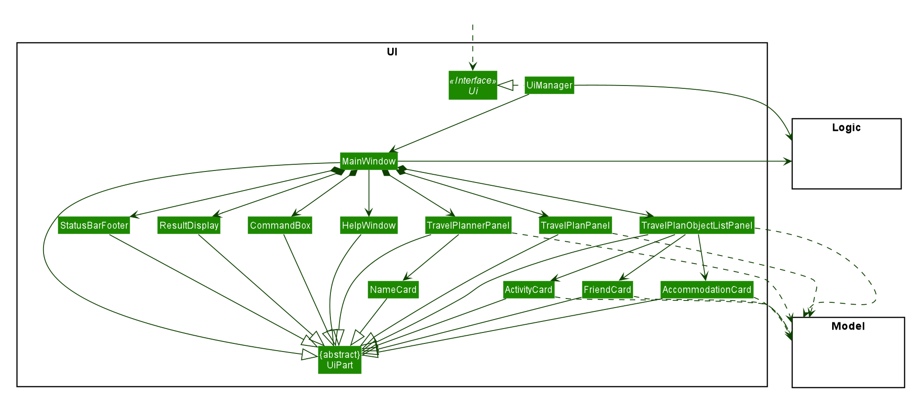

**API** :
[`Ui.java`](https://github.com/AY2021S1-CS2103-T14-3/tp/blob/master/src/main/java/seedu/address/ui/Ui.java)

The UI consists of a `MainWindow` that is made up of parts e.g.`CommandBox`, `ResultDisplay`, `TravelPlannerPanel`, `StatusBarFooter` etc. All these, including the `MainWindow`, inherit from the abstract `UiPart` class.

The `UI` component uses JavaFx UI framework. The layout of these UI parts are defined in matching `.fxml` files that are in the `src/main/resources/view` folder. For example, the layout of the [`MainWindow`](https://github.com/AY2021S1-CS2103-T14-3/tp/blob/master/src/main/java/seedu/address/ui/MainWindow.java) is specified in [`MainWindow.fxml`](https://github.com/AY2021S1-CS2103-T14-3/tp/blob/master/src/main/resources/view/MainWindow.fxml)

The `UI` component,

* Executes user commands using the `Logic` component.
* Listens for changes to `Model` data so that the UI can be updated with the modified data.

### Logic component

**API** :
[`Logic.java`](https://github.com/AY2021S1-CS2103-T14-3/tp/blob/master/src/main/java/seedu/address/logic/Logic.java)

1. `Logic` uses the `WanderlustParser` class to parse the user command.
1. This results in a `Command` object which is executed by the `LogicManager`.
1. The command execution can affect the `Model` (e.g. adding a travel plan).
1. The result of the command execution is encapsulated as a `CommandResult` object which is passed back to the `Ui`.
1. In addition, the `CommandResult` object can also instruct the `Ui` to perform certain actions, such as displaying help to the user.

Given below is the Sequence Diagram for interactions within the `Logic` component for the `execute("delete -activity 1")` API call.

:information_source: **Note:** The lifeline for `DeleteCommandParser` should end at the destroy marker (X) but due to a limitation of PlantUML, the lifeline reaches the end of diagram.

### Model component

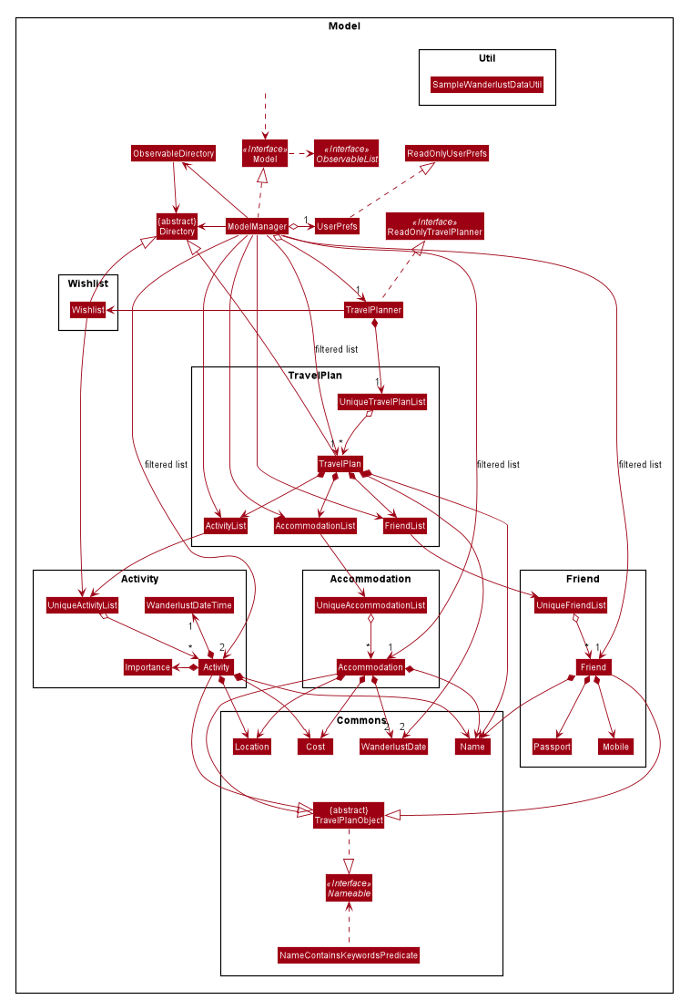

**API** : [`Model.java`](https://github.com/AY2021S1-CS2103-T14-3/tp/blob/master/src/main/java/seedu/address/model/Model.java)

The `Model`,

* stores a `UserPref` object that represents the user’s preferences.
* stores the travel planner data.
* exposes unmodifiable `ObservableList<TravelPlan>`, `ObservableList<Activity>`, `ObservableList<Accommodation>`, `ObservableList<Friend>` that can be 'observed' e.g. the UI can be bound to this list so that the UI automatically updates when the data in the list change.
* does not depend on any of the other three components.

:information_source: **Note:** An alternative (arguably, a more OOP) model is given below. It has a `Tag` list in the `AddressBook`, which `Person` references. This allows `AddressBook` to only require one `Tag` object per unique `Tag`, instead of each `Person` needing their own `Tag` object. 

### Storage component

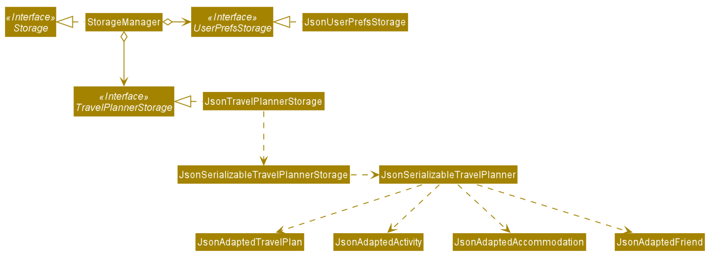

**API** : [`Storage.java`](https://github.com/AY2021S1-CS2103-T14-3/tp/blob/master/src/main/java/seedu/address/storage/Storage.java)

The `Storage` component,
* can save `UserPref` objects in json format and read it back.
* can save the travel planner data in json format and read it back.

### Common classes

Classes used by multiple components are in the `seedu.address.commons` package.

--------------------------------------------------------------------------------------------------------------------

## **Implementation**

This section describes some noteworthy details on how certain features are implemented.

### Find Feature

#### Implementation

Current implementation of Find feature is facilitated by `NameContainsKeywordsPredicate` which implements 
`Predicate<Nameable>` and has the **test** method overriden with a custom implementations.
 
The `NameContainsKeywordsPredicate#test(Nameable)` is as follows:  
* loops through the **keywords** (of type `List<String>`) and return true if there is any match with the `Nameable`

`Nameable` provides the following operation:
* `Nameable#getName()` - Return the name attribute of a `TravelPlanObject`

`NameContainsKeywordsPredicate` will be passed to `Model#updateFilteredXYZList(Predicate)` 
(`updateFilteredActivityList`, etc.). The filtered list will then be updated according to the given `Predicate` and 
automatically reflected on the Ui.

The class diagram shows the relevant classes involved:

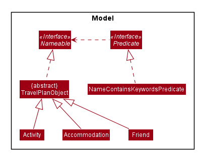

The following sequence diagram shows how the find operation works:

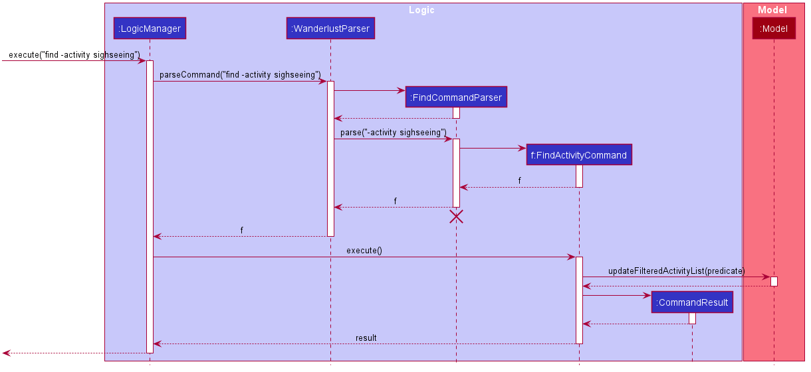

The following activity diagram summarizes what happens when a user executes the find command:

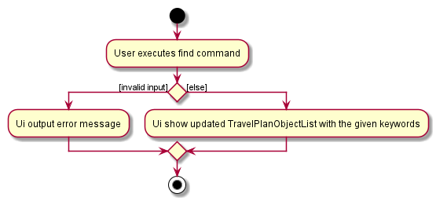

### Changing Directory

#### Implementation

<<<<<<< HEAD
*Wanderlust*'s Ui supports navigating to different *travel plans* or *wishlist* so that users can view their desired
=======
*Wanderlust*'s Ui supports navigating to different *travel plans** or *wishlist* so that users can view their desired
>>>>>>> 2a5a5a3bcce887e03175099db9afa04f236e6fc2
*travel plan* or *wishlist* easily. Starting up *Wanderlust* will show the default view of a *wishlist* and users
can use the `goto` command to navigate to their desired directory.

`TravelPlannerPanel`, `TravelPlanPanel` and `TravelPlanObjectListPanel` provide the core components for the display of
*Wanderlust*. When we are in the directory of *travelplan* or *wishlist*, `MainWindow` renders all 3 of the above
components. `TravelPlannerPanel` highlights the directory we are currently in, `TravelPlanPanel` displays the `name` of the
directory and if it is a *travelplan*, it will show the `date` of the *travelplan* as well. Lastly, `TravelPlanObjectListPanel`
displays the respective `activity`, `accommodation` and `friend` list in the UI of a particular directory. Do note that
`wishlist` should not contain any `accommodation` or `friend` list. (The UI should not be displaying anything)

Both `TravelPlannerPanel` and `TravelPlanObjectListPanel` make use of JavaFX's `ListView` to display the list of `travelplan`
or `activity`/`accommodation`/`friend` respectively.

`TravelPlannerPanel` utilizes JavaFX's `Label` to display the `name` of the directory.

`TravelPlanObjectListPanel` utilizes `TabPane` and `Tab` to display the different `activity`/`accommodation`/`friend` tabs
respectively.

The class diagram below shows the relevant classes involved:

#### Navigating between directories

`MainWindow` and `CommandResult` facilitates the navigation between directories.

Firstly, `MainWindow#fillInnerParts()` initializes an `OberservableDirectory` which **listens** to any directory changes.
`MainWindow#executeCommand()` is then called when user enters a `goto` command into the application. `MainWindow#executeCommand()`
initializes all changes to what is displayed by the UI by calling `Logic#execute()` which returns a `CommandResult`.
From `Logic#execute()`, `MainWindow#handleDirectoryChange()` will navigate the current directory to the one input by the user, changing the
UI to view the new directory. From `CommandResult`, the `ResultDisplay` Ui will then output a text specifying which directory
has been navigated to.

The activity diagram below illustrates the flow of execution when the UI decides which directory to view:

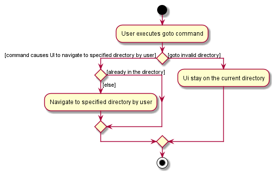

Below is a sequence diagram that shows a scenario whereby the UI navigates to a specified `travelplan` in `Wanderlust`:

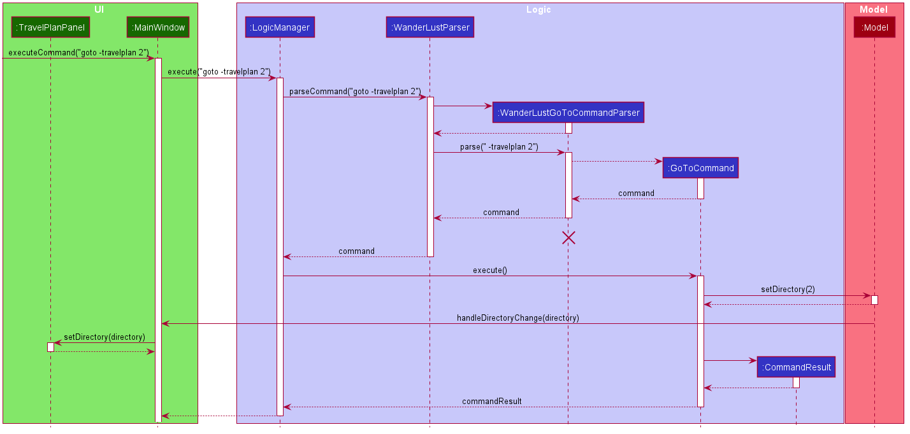

#### Design Consideration:

Aspect: How navigation between directory works

- **Alternative 1 (Current Choice)**: Initializing an observable directory in Wanderlust.
  - Pros: Main Window will always be listen to any changes in directory, allowing UI to switch fast
  - Cons: More work has to be done to sync up the UI with the model as we have to create an ObservableDirectory class and
  link to the model manager.

- **Alternative 2**: Passing the Directory as a parameter in CommandResult method
  - Pros: Easy to implement since we just have to return a new CommandResult which has an additional parameter of Directory.
  - Cons: Break the abstraction layer as Commands (Logic) should not have to be aware of how the Model is working.

### Adding a TravelPlan or TravelPlanObject

#### Implementation

*Wanderlust*'s Ui allows users to add a `TravelPlan` to the `TravelPlanner`, an `Activity` to the `Wishlist` and a `TravelPlanObject`
to the `TravelPlan` in the current directory.

`MainWindow#executeCommand()` is called when the user enters a `add` command into the application. `MainWindow#executeCommand()`
adds the TravelPlan/TravelPlanObject by calling `Logic#execute()` which returns a `CommandResult`. `Logic#execute()` also sets the
the `Directory` of the `ObservableDirectory` to the updated `Directory` after adding the TravelPlan/TravelPlanObject so the Ui displays
the updated list of `TravelPlan`s/`TravelPlanObject`s. From `CommandResult`, the `ResultDisplay` Ui will then output a text confirming
to the user that the command was successfully executed.

The activity diagram below shows a scenario whereby a user adds inputs an add command:

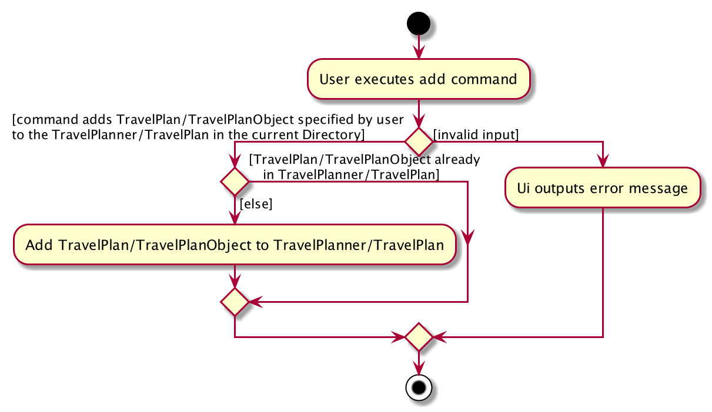

The sequence diagram below shows a scenario whereby a user adds an `Activity` to the `TravelPlan`/`Wishlist` in the current directory:

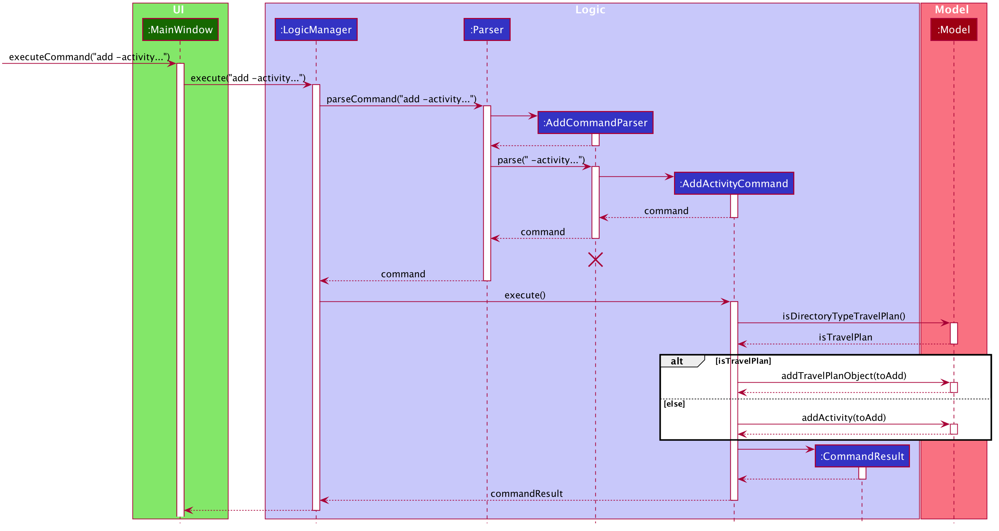

#### Design Consideration:

Aspect: How to add `TravelPlanObject`s to the `TravelPlan` in the current `Directory`

- **Alternative 1 (Current Choice)**: Use individual add commands for each sub-class of `TravelPlanObject`.
  - Pros: Greater abstraction and a more logical implementation since there is a command for each sub-class.
  - Cons: Greater repetition of code.

- **Alternative 2**: Using a `AddTravelPlanObjectCommand` class.
  - Pros: Lesser repetition of code.
  - Cons: Lesser abstraction.

### Copy feature

#### Implementation
The copy mechanism supports copying an `activity` from `Wishlist` to a specific `TravelPlan`. It is facilitated by the
add mechanism, except activities can be added to **any** `TravelPlan`  in the `TravelPlanner`, referenced by their index
*(travel plan index)*. The copy mechanism adds a **deep copy** of the activity in `Wishlist` to the specified `TravelPlan`,
not the same instance. Thus, if any activity was edited in one directory, it should not affect all other copies.

:information_source: **Note:** The copy command can only be called when
the current directory is the wishlist. Hence, index used to reference activities *(activity index)* refers to that in
the `filteredWishlist` in `Model`. This means, even if the `find` command is used to filter the activities in the
wishlist, the indexes in the `filteredWishlist` will be updated accordingly (and so will the Ui). Hence, as long as the
user uses the index as displayed in the Ui, the correct activity will be referenced.

The following sequence diagram shows how the copy operation works:

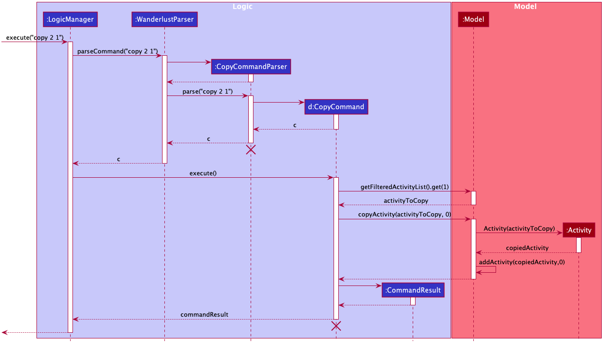

:information_source: **Note:** The lifeline for `CopyCommandParser` and
`CopyCommand` should end at the destroy marker (X) but due to a limitation of PlantUML, the lifeline reaches the end of
diagram.

:information_source: **Note:** The indexes used by CopyCommand in the `execute()` method (after parsing) is zero-based.

The following activity diagram summarizes what happens when a user executes the `copy` command:

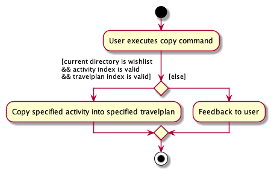

#### Design consideration:

Aspect: How to duplicate activity *(deep/shallow copy)*
- **Alternative 1 (Current Choice)**: Using a deep copy.
    - Pros: More flexibility to have different variations of the activity in different directories (e.g. different dates/times, etc).
    - Cons: Each instance is not synced with the rest. Users have to update each copy separately if they wish to do so.
    *However, there is flexibility to extend other commands (e.g. Edit command) to update all deep copies of the same activity.*
- **Alternative 2**: Using a shallow copy.
    - Pros: Only one instance of each activity means users can update all copies of the activity at once.
    - Cons: Less flexibility to change a copied activity without affecting other copies.
- **Alternative 3**: Have variations of the copy command to allow both deep/shallow copy.
    - Pros: Best of both worlds. Allows for flexibility and convenience at the same time.
    - Cons: Harder to implement. Users need a way to differentiate deep/shallow copies to avoid unintentionally editing
    a shallow copy. Potentially more edge cases to think about and handle.

### \[Proposed\] Undo/redo feature

#### Proposed Implementation

The proposed undo/redo mechanism is facilitated by `VersionedAddressBook`. It extends `AddressBook` with an undo/redo history, stored internally as an `addressBookStateList` and `currentStatePointer`. Additionally, it implements the following operations:

* `VersionedAddressBook#commit()` — Saves the current address book state in its history.
* `VersionedAddressBook#undo()` — Restores the previous address book state from its history.
* `VersionedAddressBook#redo()` — Restores a previously undone address book state from its history.

These operations are exposed in the `Model` interface as `Model#commitAddressBook()`, `Model#undoAddressBook()` and `Model#redoAddressBook()` respectively.

Given below is an example usage scenario and how the undo/redo mechanism behaves at each step.

Step 1. The user launches the application for the first time. The `VersionedAddressBook` will be initialized with the initial address book state, and the `currentStatePointer` pointing to that single address book state.

Step 2. The user executes `delete 5` command to delete the 5th person in the address book. The `delete` command calls `Model#commitAddressBook()`, causing the modified state of the address book after the `delete 5` command executes to be saved in the `addressBookStateList`, and the `currentStatePointer` is shifted to the newly inserted address book state.

Step 3. The user executes `add n/David …​` to add a new person. The `add` command also calls `Model#commitAddressBook()`, causing another modified address book state to be saved into the `addressBookStateList`.

:information_source: **Note:** If a command fails its execution, it will not call `Model#commitAddressBook()`, so the address book state will not be saved into the `addressBookStateList`.

Step 4. The user now decides that adding the person was a mistake, and decides to undo that action by executing the `undo` command. The `undo` command will call `Model#undoAddressBook()`, which will shift the `currentStatePointer` once to the left, pointing it to the previous address book state, and restores the address book to that state.

:information_source: **Note:** If the `currentStatePointer` is at index 0, pointing to the initial AddressBook state, then there are no previous AddressBook states to restore. The `undo` command uses `Model#canUndoAddressBook()` to check if this is the case. If so, it will return an error to the user rather
than attempting to perform the undo.

The following sequence diagram shows how the undo operation works:

:information_source: **Note:** The lifeline for `UndoCommand` should end at the destroy marker (X) but due to a limitation of PlantUML, the lifeline reaches the end of diagram.

The `redo` command does the opposite — it calls `Model#redoAddressBook()`, which shifts the `currentStatePointer` once to the right, pointing to the previously undone state, and restores the address book to that state.

:information_source: **Note:** If the `currentStatePointer` is at index `addressBookStateList.size() - 1`, pointing to the latest address book state, then there are no undone AddressBook states to restore. The `redo` command uses `Model#canRedoAddressBook()` to check if this is the case. If so, it will return an error to the user rather than attempting to perform the redo.

Step 5. The user then decides to execute the command `list`. Commands that do not modify the address book, such as `list`, will usually not call `Model#commitAddressBook()`, `Model#undoAddressBook()` or `Model#redoAddressBook()`. Thus, the `addressBookStateList` remains unchanged.

Step 6. The user executes `clear`, which calls `Model#commitAddressBook()`. Since the `currentStatePointer` is not pointing at the end of the `addressBookStateList`, all address book states after the `currentStatePointer` will be purged. Reason: It no longer makes sense to redo the `add n/David …​` command. This is the behavior that most modern desktop applications follow.

The following activity diagram summarizes what happens when a user executes a new command:

#### Design consideration:

##### Aspect: How undo & redo executes

* **Alternative 1 (current choice):** Saves the entire address book.
  * Pros: Easy to implement.
  * Cons: May have performance issues in terms of memory usage.

* **Alternative 2:** Individual command knows how to undo/redo by
  itself.
  * Pros: Will use less memory (e.g. for `delete`, just save the person being deleted).
  * Cons: We must ensure that the implementation of each individual command are correct.

_{more aspects and alternatives to be added}_

### \[Proposed\] Data archiving

_{Explain here how the data archiving feature will be implemented}_

--------------------------------------------------------------------------------------------------------------------

## **Documentation, logging, testing, configuration, dev-ops**

* [Documentation guide](Documentation.md)
* [Testing guide](Testing.md)
* [Logging guide](Logging.md)
* [Configuration guide](Configuration.md)
* [DevOps guide](DevOps.md)

--------------------------------------------------------------------------------------------------------------------

## **Appendix: Requirements**

### Product scope

**Target user profile**:

* Need a place to their store travel plans in an organised manner
* prefer desktop apps over other types
* CLI proficient
* prefers typing to mouse interactions
* is reasonably comfortable using CLI apps

**Value proposition**:
* Manage travel plans faster and wishlist faster than using Excel sheets/Mouse-driven Apps

### User stories

Priorities: High (must have) - `* * *`, Medium (nice to have) - `* *`, Low (unlikely to have) - `*`

| Priority | As a …​                                    | I want to …​                     | So that I can…​                                                        |
| -------- | ------------------------------------------ | ------------------------------ | ---------------------------------------------------------------------- |
| `* * *`  | new user                                   | read the user guide            | be familiar with the usages and features                |
| `* * *`  | user                                       | save travel activities in a wishlist               | use it for future travel plans      |
| `* * *`  | user                                       | add items to a travel plan             | note down important items related to my travel plan      |
| `* * *`  | user                                       | delete an item       | remove unwanted items              |
| `* * *`  | user                                       | modify an item       | edit any last minute changes              |
| `* * *`  | frequent user                                       | have a list of items    | easily see my travel plans              |
| `* * *`  | user                                       | be able to switch between travel plans   | navigate to travel plans easily              |
| `* *`    | user                                       | add notes to each travel plan  | refer to them while travelling                          |
| `* *`    | user                                       | input accommodation details         | easily remember where I am going to stay           |
| `* *`    | user                                       | input cost of activity  | track the price of each activities easily                      |
| `* *`    | user                                       | input timing to an activity         | create a schedule for my travel plan               |
| `* *`    | user                                       | record essential personal details         | have a easy time in making bookings using these details             |
| `* *`    | user                                       | sort items  | view my items in a preferred manner            |
| `* *`    | user                                       | create priority levels for activities | rank the level of importance of each activities    |
| `*`      | advanced user                              | have shortcuts for commands  | execute commands faster proficiently    |
| `*`      | user                                       | have a feature to search  | find and filter my desired items efficiently  |

*{More to be added}*

### Use cases

(For all use cases below, the **System** is the `Wanderlust` and the **Actor** is the `user`, unless specified otherwise)

**Use case: UC01 - Navigate to a specific travel plan**

**MSS**

1.  User requests to navigate to a specific travel plan
2.  Wanderlust shows that the current directory is on that travel plan

    Use case ends.

**Extensions**

* 1a. The specific travel plan doesn't exist.
    * 1a1. Wanderlust shows an error message.

      Use case ends.

**Use case: UC02 - Navigate to the wishlist**

**MSS**

1.  User requests to navigate to the wishlist
2.  Wanderlust shows that the current directory is on the wishlist

    Use case ends.

**Use case: UC03 - Add a travel plan**

**MSS**

1.  User requests to add a travel plan
2.  Wanderlust shows the newly created travel plan

    Use case ends.

**Extensions**

* 1a. The input command format is invalid.
    * 1a1. Wanderlust shows an error message.

      Use case ends.

**Use case: UC04 - Add an activity**

**MSS**

1.  User <ins>navigates to a specific travel plan (UC1)</ins>
2.  User requests to add an activity
3.  Wanderlust shows the added activities in the current directory

    Use case ends.

**Extensions**

* 1a. User is at the top directory.
    * 1a1. User requests to add an activity.
    * 1a2. Wanderlust shows an error message.

    Use case ends.

* 1b. User <ins>navigates to the wishlist (UC2)</ins>.

    Use case resumes at step 2.

* 2a. The input command format is invalid.
    * 2a1. Wanderlust shows an error message.

      Use case ends.

**Use case: UC05 - Add an accommodation**

**MSS**

1.  User <ins>navigates to a specific travel plan (UC1)</ins>
2.  User requests to add an accommodation
3.  Wanderlust shows the added accommodation in the current travel plan

    Use case ends.

**Extensions**

* 1a. User is at the top directory.
    * 1a1. User requests to add accommodation.
    * 1a2. Wanderlust shows an error message.

    Use case ends.

* 2a. The input command format is invalid.
    * 2a1. Wanderlust shows an error message.

      Use case ends.

**Use case: UC06 - Add a person**

**MSS**

1.  User <ins>navigates to a specific travel plan (UC1)</ins>
2.  User requests to add a person
3.  Wanderlust shows the added person in the current travel plan

    Use case ends.

**Extensions**

* 1a. User is at the top directory.
    * 1a1. User requests to add a person.
    * 1a2. Wanderlust shows an error message.

    Use case ends.

* 2a. The input command format is invalid.
    * 2a1. Wanderlust shows an error message.

      Use case ends.

**Use case: UC07 - Delete a travel plan**

**MSS**

1.  User requests to delete a travel plan
2.  Wanderlust shows that the travel plan has been deleted.

    Use case ends.

**Extensions**

* 1a. The input command format is invalid.
    * 1a1. Wanderlust shows an error message.

      Use case ends.

* 1b. The travel plan specified does not exist.
    * 1b1. Wanderlust shows an error message.

      Use case ends.

**Use case: UC08 - Delete an activity**

**MSS**

1.  User <ins>navigates to a specific travel plan (UC1)</ins>
2.  User requests to delete an activity
3.  Wanderlust shows that the activity has been deleted

    Use case ends.

**Extensions**

* 1a. User is at the top directory.
    * 1a1. User requests to delete an activity.
    * 1a2. Wanderlust shows an error message.

    Use case ends.

* 1b. User <ins>navigates to the wishlist (UC2)</ins>.

    Use case resumes at step 2.

* 2a. The input command format is invalid.
    * 2a1. Wanderlust shows an error message.

      Use case ends.

* 2b. The activity specified does not exist.
    * 2b1. Wanderlust shows an error message.

      Use case ends.

**Use case: UC09 - Delete an accommodation**

**MSS**

1.  User <ins>navigates to a specific travel plan (UC1)</ins>
2.  User requests to delete an accommodation
3.  Wanderlust shows that the accommodation has been deleted

    Use case ends.

**Extensions**

* 1a. User is at the top directory.
    * 1a1. User requests to delete accommodation.
    * 1a2. Wanderlust shows an error message.

    Use case ends.

* 2a. The input command format is invalid.
    * 2a1. Wanderlust shows an error message.

      Use case ends.

* 2b. The accommodation specified does not exist.
    * 2b1. Wanderlust shows an error message.

      Use case ends.

**Use case: UC10 - Delete a person**

**MSS**

1.  User <ins>navigates to a specific travel plan (UC1)</ins>
2.  User requests to delete a person
3.  Wanderlust shows that the person has been deleted

    Use case ends.

**Extensions**

* 1a. User is at the top directory.
    * 1a1. User requests to delete a person.
    * 1a2. Wanderlust shows an error message.

    Use case ends.

* 2a. The input command format is invalid.
    * 2a1. Wanderlust shows an error message.

      Use case ends.

* 2b. The person specified does not exist.
    * 2b1. Wanderlust shows an error message.

      Use case ends.

**Use case: UC11 - Edit a travel plan**

**MSS**

1. User <ins>navigates to a specific travel plan (UC1)</ins>
2. User requests to edit travel plan
3. Wanderlust shows that the travel plan has been edited

   Use case ends.

**Extensions**

*  1a. User is at the top directory.

     Use case resumes at step 2.

* 2a. The input command format is invalid.
    * 2a1. Wanderlust shows an error message.

     Use case ends.

* 2b. The travel plan specified does not exist.
    * 2b1. Wanderlust shows an error message.

     Use case ends.

**Use case: UC12 - Edit an activity**

**MSS**

1.  User <ins>navigates to a specific travel plan (UC1)</ins>
2.  User requests to edit an activity
3.  Wanderlust shows that the activity has been edited

     Use case ends.

**Extensions**

* 1a. User is at the top directory.
    * 1a1. User requests to edit an activity.
    * 1a2. Wanderlust shows an error message.

     Use case ends.

* 1b. User <ins>navigates to the wishlist (UC2)</ins>.

     Use case resumes at step 2.

* 2a. The input command format is invalid.
    * 2a1. Wanderlust shows an error message.

      Use case ends.

* 2b. The activity specified does not exist.
    * 2b1. Wanderlust shows an error message.

      Use case ends.

**Use case: UC13 - Edit an accommodation**

**MSS**

1.  User <ins>navigates to a specific travel plan (UC1)</ins>
2.  User requests to edit an accommodation
3.  Wanderlust shows that the accommodation has been edited

    Use case ends.

**Extensions**

* 1a. User is at the top directory.
    * 1a1. User requests to edit accommodation.
    * 1a2. Wanderlust shows an error message.

    Use case ends.

* 2a. The input command format is invalid.
    * 2a1. Wanderlust shows an error message.

      Use case ends.

* 2b. The accommodation specified does not exist.
    * 2b1. Wanderlust shows an error message.

      Use case ends.

**Use case: UC14 - Edit a person**

**MSS**

1.  User <ins>navigates to a specific travel plan (UC1)</ins>
2.  User requests to edit a person
3.  Wanderlust shows that the person has been edited

    Use case ends.

**Extensions**

* 1a. User is at the top directory.
    * 1a1. User requests to edit a person.
    * 1a2. Wanderlust shows an error message.

    Use case ends.

* 2a. The input command format is invalid.
    * 2a1. Wanderlust shows an error message.

      Use case ends.

* 2b. The person specified does not exist.
    * 2b1. Wanderlust shows an error message.

      Use case ends.

**Use case: UC15 - View activities**

**MSS**

1.  User <ins>navigates to a specific travel plan (UC1)</ins>
2.  User requests to view activities
3.  Wanderlust shows the list of activities

    Use case ends.

**Extensions**

* 1a. User is at the top directory.
    * 1a1. User requests to view activities.
    * 1a2. Wanderlust shows an error message.

    Use case ends.

* 1b. User <ins>navigates to the wishlist (UC2)</ins>.

    Use case resumes at step 2.

* 2a. The input command format is invalid.
    * 2a1. Wanderlust shows an error message.

      Use case ends.

**Use case: UC16 - View contacts in travel plan**

**MSS**

1.  User <ins>navigates to a specific travel plan (UC1)</ins>
2.  User requests to view contacts
3.  Wanderlust shows the list of contacts

    Use case ends.

**Extensions**

* 1a. User is at the top directory.
    * 1a1. User requests to view contacts.
    * 1a2. Wanderlust shows an error message.

    Use case ends.

* 2a. The input command format is invalid.
    * 2a1. Wanderlust shows an error message.

      Use case ends.

**Use case: UC17 - View accommodation in travel plan**

**MSS**

1.  User <ins>navigates to a specific travel plan (UC1)</ins>
2.  User requests to view accommodation
3.  Wanderlust shows the list of accommodation

    Use case ends.

**Extensions**

* 1a. User is at the top directory.
    * 1a1. User requests to view accommodation.
    * 1a2. Wanderlust shows an error message.

    Use case ends.

* 2a. The input command format is invalid.
    * 2a1. Wanderlust shows an error message.

      Use case ends.

*{More to be added}*

### Non-Functional Requirements

1.  Should work on any mainstream OS_ as long as it has Java `11` or above installed.
2.  The travel planner should be able to hold up to 1000 activities without a noticeable sluggishness in performance for typical usage.
3.  Should be able to respond to user commands within 1 second.
4.  A user with above average typing speed for regular English text (i.e. not code, not system admin commands) should be able to accomplish most of the tasks faster using commands than using the mouse.
5.  Should be a single-user product.
6.  Users familiar with JSON should be able to read and edit the storage file.
7.  Should work without internet connection.

### Glossary

* **Mainstream OS**: Windows, Linux, Unix, OS-X
* **Private contact detail**: A contact detail that is not meant to be shared with others
* **Wishlist**: A list of potential activities
* **Travel plan**: A list of accommodations and activities in a specified location that can include `start_date` and `end_date`
* **Activity**: Minimally includes the `name`, we can add information about level of importance, `cost`, `location`, `timestamp` and `tags` to it
* **Accommodation**: Minimally includes the `name`, we can add information about `location`, `cost` and `nights` to it
* **Person**: Contains information about a given person `name`, `mobile number` and `passport number`
* **Directory**: The three possible directories are `top`, `travelplan`, `wishlist`
* **Navigate**: Use the `goto` command to move between directories
* **View**: Use the `show` command to provide a list of specified items

*{More to be added}*
--------------------------------------------------------------------------------------------------------------------

## **Appendix: Instructions for manual testing**

Given below are instructions to test the app manually.

:information_source: **Note:** These instructions only provide a starting point for testers to work on;
testers are expected to do more *exploratory* testing.

### Launch and shutdown

1. Initial launch

   1. Download the jar file and copy into an empty folder

   1. Double-click the jar file Expected: Shows the GUI with a set of sample contacts. The window size may not be optimum.

1. Saving window preferences

   1. Resize the window to an optimum size. Move the window to a different location. Close the window.

   1. Re-launch the app by double-clicking the jar file. 
       Expected: The most recent window size and location is retained.

1. _{ more test cases …​ }_

### Deleting a person

1. Deleting a person while all persons are being shown

   1. Prerequisites: List all persons using the `list` command. Multiple persons in the list.

   1. Test case: `delete 1` 
      Expected: First contact is deleted from the list. Details of the deleted contact shown in the status message. Timestamp in the status bar is updated.

   1. Test case: `delete 0` 
      Expected: No person is deleted. Error details shown in the status message. Status bar remains the same.

   1. Other incorrect delete commands to try: `delete`, `delete x`, `...` (where x is larger than the list size) 
      Expected: Similar to previous.

1. _{ more test cases …​ }_

### Saving data

1. Dealing with missing/corrupted data files

   1. _{explain how to simulate a missing/corrupted file, and the expected behavior}_

1. _{ more test cases …​ }_
